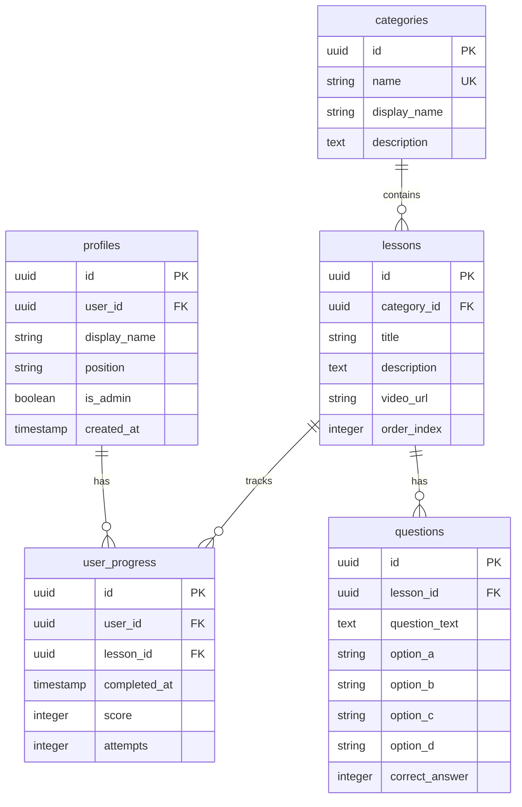

# ⚡ CapacitaJun - Sistema de Capacitação

<div align="center">


**Plataforma gamificada de capacitação para empresas juniores**

[](https://reactjs.org/)
[](https://www.typescriptlang.org/)
[](https://supabase.com/)
[](https://tailwindcss.com/)
[](https://ui.shadcn.com/)

[🚀 Demo](https://eletronjun-demo.com) • [📖 Documentação](./docs) • [🐛 Issues](https://github.com/eletronjun/trilha-eletronjun/issues)

</div>

---

## 🎯 Sobre o Projeto

O **CapacitaJun** é uma plataforma moderna de capacitação gamificada, especialmente desenvolvida para empresas juniores. Combina trilhas de aprendizado estruturadas, sistema de gamificação e um painel administrativo completo para gestão de conteúdo e progresso.

### ✨ Principais Características

- 🎮 **Gamificação**: Sistema de níveis, pontuações e rankings
- 📚 **Trilhas Personalizadas**: Conteúdo organizado por categorias
- 🎥 **Múltiplos Formatos**: Vídeos, links externos e conteúdo interativo
- 📊 **Analytics**: Dashboard completo com métricas de engajamento
- 👥 **Multi-tenant**: Suporte a múltiplas organizações
- 📱 **Responsivo**: Design mobile-first

## 🖥️ Screenshots

<div align="center">

### Tela Inicial & Login


### Dashboard do Usuário


### Painel Administrativo


</div>

## 🚀 Funcionalidades

### Para Usuários

- ✅ **Trilhas Interativas**: Navegação sequencial com desbloqueio progressivo
- ✅ **Quiz Gamificado**: Questões de múltipla escolha com feedback imediato
- ✅ **Progresso Visual**: Barras de progresso e conquistas
- ✅ **Ranking**: Competição saudável entre membros
- ✅ **Perfil Personalizado**: Histórico e estatísticas pessoais

### Para Administradores

- ✅ **Dashboard Analytics**: Métricas em tempo real de engajamento
- ✅ **Gestão de Conteúdo**: CRUD completo de lições e questões
- ✅ **Gerenciamento de Usuários**: Controle de acesso e permissões
- ✅ **Relatórios de Progresso**: Acompanhamento detalhado por usuário
- ✅ **Categorização**: Organização flexível do conteúdo

## 🛠️ Stack Tecnológica

### Frontend

- **React 18** - Framework JavaScript moderno
- **TypeScript** - Tipagem estática para maior robustez
- **Tailwind CSS** - Framework CSS utility-first
- **shadcn/ui** - Componentes UI elegantes e acessíveis
- **Lucide React** - Ícones SVG otimizados
- **React Hook Form** - Gerenciamento de formulários performático
- **Zod** - Validação de schemas TypeScript-first

### Backend & Database

- **Supabase** - Backend-as-a-Service com PostgreSQL
- **Row Level Security (RLS)** - Segurança granular de dados
- **Real-time subscriptions** - Atualizações em tempo real
- **Authentication** - Sistema completo de autenticação

### Ferramentas de Desenvolvimento

- **Vite** - Build tool ultra-rápida
- **ESLint** - Linting de código
- **Prettier** - Formatação consistente
- **Husky** - Git hooks para qualidade

## 📦 Instalação

### Pré-requisitos

- Node.js 18+
- npm ou yarn
- Conta no Supabase

### 1. Clone o Repositório

```bash
git clone https://github.com/eletronjun/trilha-eletronjun.git
cd trilha-eletronjun
```

### 2. Instale as Dependências

```bash
npm install
# ou
yarn install
```

### 3. Configure as Variáveis de Ambiente

```bash
cp .env.example .env.local
```

Edite `.env.local`:

```env
VITE_SUPABASE_URL=sua_supabase_url
VITE_SUPABASE_ANON_KEY=sua_supabase_anon_key
```

### 4. Configure o Banco de Dados

Execute os scripts SQL do diretório `/docs/sql/` no Supabase:

```bash
# 1. Estrutura inicial
psql < docs/sql/01_initial_schema.sql

# 2. Dados de exemplo
psql < docs/sql/02_seed_data.sql

# 3. Políticas de segurança
psql < docs/sql/03_security_policies.sql
```

### 5. Execute o Projeto

```bash
npm run dev
# ou
yarn dev
```

Acesse `http://localhost:5173`

## 🎮 Como Usar

### Usuário Comum

1. **Cadastro/Login**: Registre-se com email @eletronjun.com.br
2. **Escolha sua Trilha**: Selecione uma categoria de interesse
3. **Progresso Sequential**: Complete lições na ordem para desbloquear as próximas
4. **Responda Quizzes**: Alcance 80% de acerto para concluir a lição
5. **Acompanhe seu Ranking**: Veja sua posição no ranking mensal

### Administrador

1. **Login Admin**: Use `admin@eletronjun.com.br`
2. **Dashboard**: Monitore estatísticas em tempo real
3. **Criar Conteúdo**: Adicione lições com vídeos ou links
4. **Gerenciar Usuários**: Edite informações e acompanhe progresso
5. **Análises**: Visualize relatórios detalhados de engajamento

## 🏗️ Estrutura do Projeto

```
src/
├── components/           # Componentes reutilizáveis
│   ├── admin/           # Componentes do painel admin
│   ├── ui/              # Componentes base (shadcn/ui)
│   └── ...
├── pages/               # Páginas principais
│   ├── Admin.tsx        # Painel administrativo
│   ├── Auth.tsx         # Autenticação
│   ├── Index.tsx        # Dashboard do usuário
│   └── Landing.tsx      # Página inicial
├── hooks/               # React hooks customizados
├── lib/                 # Utilitários e configurações
├── integrations/        # Integrações externas (Supabase)
└── types/              # Definições TypeScript
```

## 🔐 Configuração de Segurança

### Row Level Security (RLS)

O sistema usa políticas RLS do Supabase para garantir isolamento de dados:

```sql
-- Usuários só veem seu próprio progresso
CREATE POLICY "Users can view own progress" ON user_progress
  FOR SELECT USING (auth.uid() = user_id);

-- Admins podem ver tudo
CREATE POLICY "Admins can view all data" ON user_progress
  FOR SELECT USING (
    EXISTS (SELECT 1 FROM profiles WHERE user_id = auth.uid() AND is_admin = true)
  );
```

### Autenticação

- **JWT tokens** para sessões seguras
- **Email verification** obrigatório
- **Password reset** via email
- **Role-based access** (usuário/admin)

## 📊 Banco de Dados

### Esquema Principal



## 🧪 Testes

```bash
# Testes unitários
npm run test

# Testes de integração
npm run test:integration

# Testes end-to-end
npm run test:e2e

# Coverage
npm run test:coverage
```

## 🚢 Deploy

### Vercel (Recomendado)

```bash
# Instalar Vercel CLI
npm i -g vercel

# Deploy
vercel --prod
```

### Docker

```bash
# Build da imagem
docker build -t eletronjun .

# Executar container
docker run -p 3000:3000 eletronjun
```

## 🤝 Contribuindo

1. **Fork** o projeto
2. **Crie** uma branch para sua feature (`git checkout -b feature/AmazingFeature`)
3. **Commit** suas mudanças (`git commit -m 'Add some AmazingFeature'`)
4. **Push** para a branch (`git push origin feature/AmazingFeature`)
5. **Abra** um Pull Request

### Convenções

- **Commits**: Use [Conventional Commits](https://www.conventionalcommits.org/)
- **Código**: Siga o ESLint e Prettier configurados
- **Testes**: Mantenha coverage > 80%
- **Documentação**: Documente novas funcionalidades

## 📄 Licença

Este projeto está sob a licença MIT. Veja o arquivo [LICENSE](./LICENSE) para mais detalhes.

## 👥 Equipe

<div align="center">

|                                                                           |
| :---------------------------------------------------------------------------------------------------------------------------------: |
|                                                        **Gabriel Monteiro**                                                         |
|                                                      _Desenvolvedor Principal_                                                      |
| [](https://github.com/gabrielsmonteiro) |

</div>

## 📞 Suporte

- 📧 **Email**: suporte@eletronjun.com.br
- 💬 **Discord**: [EletronJun Community](https://discord.gg/eletronjun)
- 📝 **Issues**: [GitHub Issues](https://github.com/eletronjun/trilha-eletronjun/issues)
- 📖 **Docs**: [Documentação Completa](https://docs.eletronjun.com.br)

## 🙏 Agradecimentos

- [React Team](https://reactjs.org/) pela incrível biblioteca
- [Supabase](https://supabase.com/) pela plataforma backend
- [shadcn/ui](https://ui.shadcn.com/) pelos componentes elegantes
- [Lucide](https://lucide.dev/) pelos ícones lindos

---

<div align="center">

**⚡ Feito com ❤️ pela equipe EletronJun**

[](https://github.com/eletronjun/trilha-eletronjun/stargazers)
[](https://github.com/eletronjun/trilha-eletronjun/network/members)

</div>
